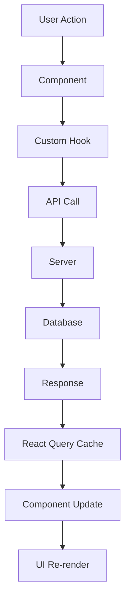
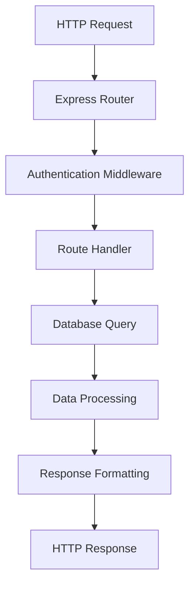
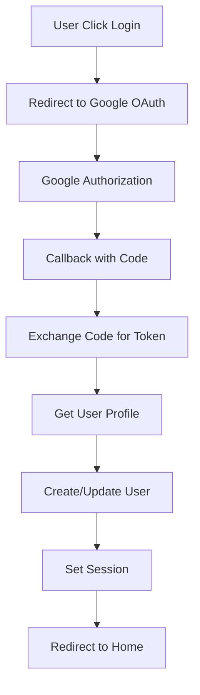
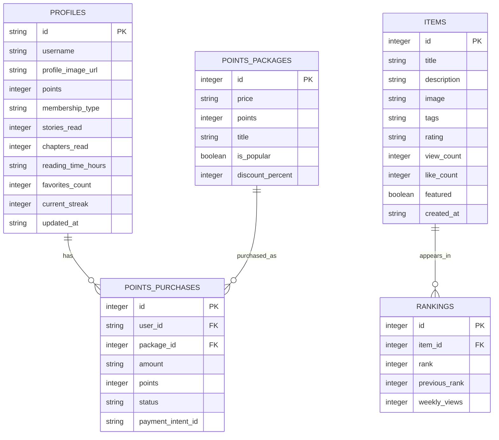

# 시스템 아키텍처 문서

## 📋 개요

Visual Novel Hub는 React 기반의 프론트엔드와 Express.js 기반의 백엔드를 가진 풀스택 웹 애플리케이션입니다. 이 문서는 시스템의 전체 아키텍처, 설계 원칙, 그리고 주요 구성 요소들을 설명합니다.

## 🏗️ 전체 아키텍처

### 아키텍처 다이어그램

```
┌─────────────────────────────────────────────────────────────────┐
│                        Client Layer                             │
├─────────────────────────────────────────────────────────────────┤
│                     React Frontend                              │
│  ┌─────────────┐  ┌─────────────┐  ┌─────────────┐            │
│  │    Pages    │  │ Components  │  │    Hooks    │            │
│  └─────────────┘  └─────────────┘  └─────────────┘            │
│  ┌─────────────┐  ┌─────────────┐  ┌─────────────┐            │
│  │  Libraries  │  │    Types    │  │ Utilities   │            │
│  └─────────────┘  └─────────────┘  └─────────────┘            │
├─────────────────────────────────────────────────────────────────┤
│                     API Layer                                   │
├─────────────────────────────────────────────────────────────────┤
│                     Express Backend                             │
│  ┌─────────────┐  ┌─────────────┐  ┌─────────────┐            │
│  │    Auth     │  │   Routes    │  │  Middleware │            │
│  └─────────────┘  └─────────────┘  └─────────────┘            │
│  ┌─────────────┐  ┌─────────────┐  ┌─────────────┐            │
│  │  Database   │  │   Proxy     │  │    Utils    │            │
│  └─────────────┘  └─────────────┘  └─────────────┘            │
├─────────────────────────────────────────────────────────────────┤
│                     Data Layer                                  │
├─────────────────────────────────────────────────────────────────┤
│                      SQLite Database                           │
│  ┌─────────────┐  ┌─────────────┐  ┌─────────────┐            │
│  │   Profiles  │  │    Items    │  │  Rankings   │            │
│  └─────────────┘  └─────────────┘  └─────────────┘            │
│  ┌─────────────┐  ┌─────────────┐                              │
│  │   Points    │  │  Purchases  │                              │
│  └─────────────┘  └─────────────┘                              │
└─────────────────────────────────────────────────────────────────┘
```

## 🔧 기술 스택

### Frontend Stack
```typescript
// 핵심 프레임워크
React 18.3.1          // UI 라이브러리
TypeScript 5.6.3      // 타입 안전성
Vite 5.4.14           // 빌드 도구

// 상태 관리
React Query 5.60.5    // 서버 상태 관리
React Context API     // 전역 상태 (언어, 테마, 인증)

// 라우팅
Wouter 3.3.5          // 경량 라우터

// 스타일링
Tailwind CSS 3.4.17   // 유틸리티 CSS
Class Variance Authority 0.7.1  // 컴포넌트 변형 관리
Tailwind Merge 2.6.0  // 클래스 병합

// UI 컴포넌트
Radix UI (40+ 컴포넌트) // 접근성 중심 프리미티브
Lucide React 0.453.0   // 아이콘 라이브러리

// 애니메이션
Framer Motion 11.13.1  // 모션 그래픽
```

### Backend Stack
```typescript
// 서버 프레임워크
Node.js               // 런타임
Express 4.21.2        // 웹 프레임워크
TypeScript 5.6.3      // 타입 안전성

// 데이터베이스
Better SQLite3 12.1.1 // 데이터베이스
Drizzle ORM 0.39.1    // 타입 안전 ORM

// 인증
Passport.js 0.7.0     // 인증 미들웨어
Google OAuth 2.0      // 소셜 로그인

// 검증
Zod 3.24.2           // 스키마 검증

// 보안
Helmet 8.1.0         // 보안 헤더
CORS 2.8.5           // 크로스 오리진 요청
Rate Limiting 7.5.1  // 요청 제한
```

## 📁 프로젝트 구조

### 상세 폴더 구조
```
VN-app/
├── client/                          # 프론트엔드 코드
│   ├── src/
│   │   ├── components/             # React 컴포넌트
│   │   │   ├── ui/                # Shadcn/ui 컴포넌트 (40개+)
│   │   │   ├── novel-card.tsx     # 노벨 카드 컴포넌트
│   │   │   ├── header.tsx         # 헤더 컴포넌트
│   │   │   ├── bottom-navigation.tsx  # 하단 네비게이션
│   │   │   ├── language-selector.tsx  # 언어 선택기
│   │   │   ├── theme-provider.tsx     # 테마 제공자
│   │   │   └── coming-soon-modal.tsx  # 개발 중 모달
│   │   ├── hooks/                  # 커스텀 훅
│   │   │   ├── useAuth.ts         # 인증 훅
│   │   │   ├── use-language.tsx   # 언어 설정 훅
│   │   │   ├── use-mobile.tsx     # 모바일 감지 훅
│   │   │   ├── use-drag-scroll.tsx # 드래그 스크롤 훅
│   │   │   └── use-toast.ts       # 토스트 알림 훅
│   │   ├── lib/                   # 라이브러리 설정
│   │   │   ├── i18n.ts           # 다국어 데이터
│   │   │   ├── queryClient.ts    # React Query 설정
│   │   │   ├── supabase.ts       # Supabase 설정
│   │   │   └── utils.ts          # 유틸리티 함수
│   │   ├── pages/                 # 페이지 컴포넌트
│   │   │   ├── home.tsx          # 홈페이지
│   │   │   ├── novel-detail.tsx  # 노벨 상세 페이지
│   │   │   ├── search.tsx        # 검색 페이지
│   │   │   ├── ranking.tsx       # 랭킹 페이지
│   │   │   ├── my-page.tsx       # 마이페이지
│   │   │   ├── login.tsx         # 로그인 페이지
│   │   │   ├── buy-points.tsx    # 포인트 구매 페이지
│   │   │   └── not-found.tsx     # 404 페이지
│   │   ├── types/                 # 타입 정의
│   │   │   └── index.ts          # 전역 타입
│   │   ├── App.tsx               # 루트 컴포넌트
│   │   ├── main.tsx              # 애플리케이션 진입점
│   │   └── index.css             # 글로벌 스타일
│   └── index.html                # HTML 템플릿
├── server/                         # 백엔드 코드
│   ├── auth.ts                    # 인증 로직
│   ├── db.ts                      # 데이터베이스 연결
│   ├── routes.ts                  # API 라우트
│   ├── index.ts                   # 서버 진입점
│   ├── sitemap.ts                 # SEO 사이트맵
│   ├── seed.ts                    # 데이터 시드
│   └── vite.ts                    # Vite 개발 서버
├── shared/                         # 공유 코드
│   └── schema.ts                  # Drizzle 스키마
├── drizzle/                       # 데이터베이스 마이그레이션
│   ├── 0000_mute_hobgoblin.sql
│   ├── 0001_first_mordo.sql
│   ├── 0002_abandoned_namorita.sql
│   └── meta/                      # 마이그레이션 메타데이터
├── docs/                          # 문서화
│   ├── README.md
│   ├── API.md
│   ├── ARCHITECTURE.md
│   ├── COMPONENTS.md
│   ├── DATABASE.md
│   ├── DEPLOYMENT.md
│   └── INTERNATIONALIZATION.md
├── attached_assets/               # 정적 파일
├── package.json                   # 프로젝트 의존성
├── tsconfig.json                  # TypeScript 설정
├── tailwind.config.ts             # Tailwind 설정
├── vite.config.ts                 # Vite 설정
└── drizzle.config.ts              # Drizzle 설정
```

## 🎯 설계 원칙

### 1. 타입 안전성
```typescript
// 전체 프로젝트에서 TypeScript 사용
// 프론트엔드-백엔드 간 타입 공유
// Drizzle ORM을 통한 타입 안전한 데이터베이스 접근
// Zod를 통한 런타임 타입 검증

// 예시: 타입 안전한 API 호출
const { data: items } = useQuery<Item[]>({
  queryKey: ['items'],
  queryFn: async () => {
    const response = await fetch('/api/items');
    return response.json();
  }
});
```

### 2. 컴포넌트 기반 아키텍처
```typescript
// Atomic Design 원칙 적용
// 재사용 가능한 UI 컴포넌트
// 관심사 분리: 프레젠테이션 vs 비즈니스 로직
// 단일 책임 원칙

// 예시: 컴포넌트 계층 구조
<App>
  <Header>
    <LanguageSelector />
  </Header>
  <Router>
    <Home>
      <NovelCard />
    </Home>
  </Router>
  <BottomNavigation />
</App>
```

### 3. 상태 관리 패턴
```typescript
// 계층적 상태 관리
// 전역 상태: Context API (언어, 테마, 인증)
// 서버 상태: React Query (API 데이터)
// 로컬 상태: useState (컴포넌트 내부)
// URL 상태: Wouter (라우팅)

// 예시: 상태 관리 구조
const AppProvider = ({ children }) => (
  <QueryClient>
    <ThemeProvider>
      <LanguageProvider>
        <AuthProvider>
          {children}
        </AuthProvider>
      </LanguageProvider>
    </ThemeProvider>
  </QueryClient>
);
```

### 4. 모듈화 및 재사용성
```typescript
// 기능별 모듈 분리
// 공통 유틸리티 함수 추출
// 커스텀 훅을 통한 로직 재사용
// 설정 파일 분리

// 예시: 모듈화된 훅
export const useAuth = () => {
  // 인증 로직
};

export const useLanguage = () => {
  // 언어 설정 로직
};
```

## 🔄 데이터 플로우

### 1. 클라이언트 측 데이터 플로우


### 2. 서버 측 데이터 플로우


### 3. 인증 플로우


## 📊 데이터베이스 설계

### 데이터베이스 스키마
```sql
-- 사용자 프로필
CREATE TABLE profiles (
  id TEXT PRIMARY KEY,
  username TEXT,
  profile_image_url TEXT,
  points INTEGER DEFAULT 0,
  membership_type TEXT DEFAULT 'free',
  stories_read INTEGER DEFAULT 0,
  chapters_read INTEGER DEFAULT 0,
  reading_time_hours TEXT DEFAULT '0',
  favorites_count INTEGER DEFAULT 0,
  current_streak INTEGER DEFAULT 0,
  updated_at TEXT
);

-- 비주얼 노벨 아이템
CREATE TABLE items (
  id INTEGER PRIMARY KEY AUTOINCREMENT,
  title TEXT NOT NULL,
  description TEXT NOT NULL,
  image TEXT NOT NULL,
  tags TEXT NOT NULL DEFAULT '[]',  -- JSON 배열
  rating TEXT NOT NULL DEFAULT '0',
  view_count INTEGER DEFAULT 0,
  like_count INTEGER DEFAULT 0,
  featured BOOLEAN DEFAULT false,
  created_at TEXT
);

-- 랭킹 시스템
CREATE TABLE rankings (
  id INTEGER PRIMARY KEY AUTOINCREMENT,
  item_id INTEGER REFERENCES items(id),
  rank INTEGER NOT NULL,
  previous_rank INTEGER,
  weekly_views INTEGER DEFAULT 0
);

-- 포인트 패키지
CREATE TABLE points_packages (
  id INTEGER PRIMARY KEY AUTOINCREMENT,
  price TEXT NOT NULL,
  points INTEGER NOT NULL,
  title TEXT NOT NULL,
  is_popular BOOLEAN DEFAULT false,
  discount_percent INTEGER DEFAULT 0
);

-- 포인트 구매 기록
CREATE TABLE points_purchases (
  id INTEGER PRIMARY KEY AUTOINCREMENT,
  user_id TEXT REFERENCES profiles(id),
  package_id INTEGER REFERENCES points_packages(id),
  amount TEXT NOT NULL,
  points INTEGER NOT NULL,
  status TEXT DEFAULT 'pending',
  payment_intent_id TEXT
);
```

### 데이터베이스 관계


## 🔐 보안 아키텍처

### 1. 인증 및 권한 부여
```typescript
// Passport.js 기반 인증
// Google OAuth 2.0 전략
// 세션 기반 인증
// 보호된 라우트 미들웨어

// 예시: 인증 미들웨어
export const requireAuth = (req, res, next) => {
  if (!req.user) {
    return res.status(401).json({ error: 'Authentication required' });
  }
  next();
};
```

### 2. 데이터 보안
```typescript
// 데이터베이스 연결 보안
// SQL 인젝션 방지 (Drizzle ORM)
// XSS 방지 (Helmet 미들웨어)
// CSRF 방지 (SameSite 쿠키)

// 예시: 보안 설정
app.use(helmet({
  contentSecurityPolicy: {
    directives: {
      defaultSrc: ["'self'"],
      styleSrc: ["'self'", "'unsafe-inline'"],
      scriptSrc: ["'self'"]
    }
  }
}));
```

### 3. 네트워크 보안
```typescript
// CORS 설정
// 요청 속도 제한
// 화이트리스트 도메인 필터링
// 이미지 프록시 보안

// 예시: CORS 설정
app.use(cors({
  origin: process.env.CLIENT_URL || 'http://localhost:3000',
  credentials: true
}));
```

## 🚀 성능 최적화

### 1. 프론트엔드 최적화
```typescript
// React Query 캐싱
// 컴포넌트 지연 로딩
// 이미지 최적화 (프록시)
// 번들 크기 최적화

// 예시: 캐싱 설정
const queryClient = new QueryClient({
  defaultOptions: {
    queries: {
      staleTime: 5 * 60 * 1000, // 5분
      cacheTime: 10 * 60 * 1000, // 10분
    },
  },
});
```

### 2. 백엔드 최적화
```typescript
// 데이터베이스 인덱싱
// 쿼리 최적화
// 응답 압축
// 정적 파일 캐싱

// 예시: 쿼리 최적화
const getRankingsWithItems = async () => {
  return await db
    .select()
    .from(rankings)
    .innerJoin(items, eq(rankings.itemId, items.id))
    .orderBy(rankings.rank);
};
```

### 3. 네트워크 최적화
```typescript
// 이미지 프록시 캐싱
// 정적 파일 압축
// HTTP/2 지원
// CDN 사용 준비

// 예시: 이미지 프록시 캐싱
app.get('/proxy/*', (req, res) => {
  res.setHeader('Cache-Control', 'public, max-age=3600');
  // 프록시 로직
});
```

## 🌍 다국어 지원 아키텍처

### 언어 지원 시스템
```typescript
// 15개 언어 지원
// 컨텍스트 기반 전역 언어 상태
// 로컬 스토리지 지속성
// 동적 번역 시스템

// 예시: 언어 컨텍스트
const LanguageContext = createContext<LanguageContextType>({
  language: 'ko',
  setLanguage: () => {}
});

// 번역 함수
export const getTranslation = (key: string, language: string): string => {
  return translations[language]?.[key] || key;
};
```

### 지원 언어 목록
```typescript
const supportedLanguages = [
  'ko', 'en', 'ja', 'zh-CN', 'zh-TW',
  'es', 'fr', 'de', 'it', 'pt',
  'ru', 'ar', 'hi', 'th', 'vi'
];
```

## 🔧 개발 및 배포 아키텍처

### 개발 환경
```typescript
// Vite 개발 서버
// 핫 모듈 교체 (HMR)
// TypeScript 컴파일
// 자동 새로고침

// 예시: 개발 서버 설정
export default defineConfig({
  plugins: [react()],
  server: {
    proxy: {
      '/api': 'http://localhost:5000',
      '/proxy': 'http://localhost:5000',
    },
  },
});
```

### 빌드 프로세스
```typescript
// Vite 빌드
// TypeScript 컴파일
// 번들 최적화
// 정적 파일 생성

// 예시: 빌드 스크립트
"scripts": {
  "build": "vite build && esbuild server/index.ts --platform=node --packages=external --bundle --format=esm --outdir=dist",
  "start": "NODE_ENV=production node dist/index.js"
}
```

## 📱 모바일 최적화

### 반응형 디자인
```typescript
// 모바일 우선 설계
// 터치 제스처 지원
// 드래그 스크롤 기능
// 적응형 레이아웃

// 예시: 모바일 감지
const useMobile = () => {
  const [isMobile, setIsMobile] = useState(false);
  
  useEffect(() => {
    const checkMobile = () => {
      setIsMobile(window.innerWidth < 768);
    };
    
    checkMobile();
    window.addEventListener('resize', checkMobile);
    
    return () => window.removeEventListener('resize', checkMobile);
  }, []);
  
  return isMobile;
};
```

## 🔮 확장성 및 미래 계획

### 크로스 플랫폼 준비
```typescript
// React Native 호환 코드 구조
// 공유 비즈니스 로직
// 플랫폼별 UI 컴포넌트
// 타입 안전성 유지

// 예시: 플랫폼별 컴포넌트
// Button.web.tsx
// Button.native.tsx
// Button.types.ts (공통 타입)
```

### 마이크로서비스 아키텍처 준비
```typescript
// 도메인별 모듈 분리
// API 게이트웨이 패턴
// 독립적 배포 가능
// 서비스 간 통신 인터페이스

// 예시: 서비스 분리
// auth-service/
// content-service/
// user-service/
// payment-service/
```

## 📊 모니터링 및 로깅

### 애플리케이션 모니터링
```typescript
// 성능 메트릭 수집
// 오류 추적
// 사용자 행동 분석
// 서버 상태 모니터링

// 예시: 오류 로깅
const handleError = (error: Error, context: string) => {
  console.error(`[${context}] ${error.message}`, error);
  // 외부 로깅 서비스로 전송
};
```

이 아키텍처 문서는 Visual Novel Hub 프로젝트의 전체적인 시스템 설계와 구현 방식을 설명합니다. 각 컴포넌트는 확장 가능하고 유지보수가 용이하도록 설계되었으며, 향후 React Native 플랫폼으로의 확장을 고려한 구조를 가지고 있습니다.